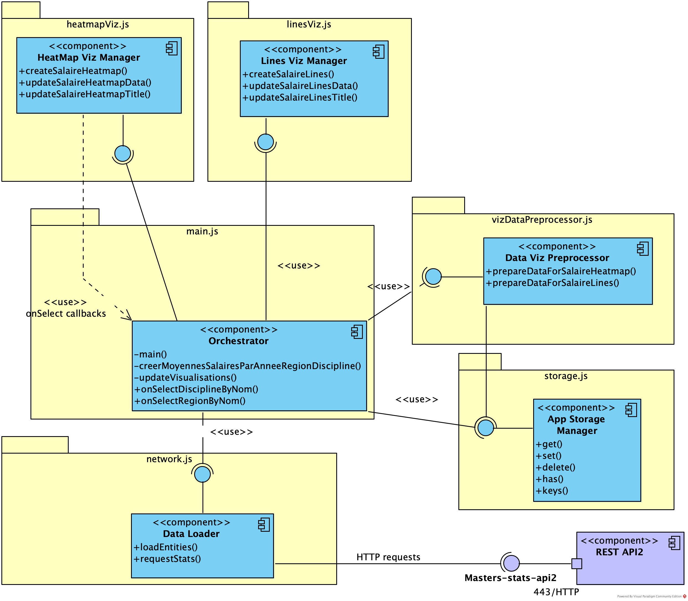

# Demonstration de l'exploitation de Masters-stats-api avec fetch et echarts

__Diagramme de composants de l'application web__

## Prérequis :

_Si vous récupérez ce projet depuis un dépôt GIT :_

- node.js ≥ 22
- un serveur HTTP ou un live serveur d'IDE

_Si vous récupérez ce projet depuis une archive zip :_

- un serveur HTTP ou un _live server_ d'IDE

## Mise en oeuvre :

_Si vous récupérez ce projet depuis un dépôt GIT :_

- installez les dépendances avec npm: `npm install`
- accès à la page index.html depuis votre serveur HTTP (ou votre _live server_)

_Si vous récupérez ce projet depuis une archive zip :_

- accès à la page index.html depuis votre serveur HTTP (ou votre _live server_)

## Composants

L'application est composée de 6 modules js : network.js, storage.js vizDataPreprocessor.js, heatmapViz.js, linesViz.js et main.js.

Les composants, illustrés en bleu, sont des regroupements conceptuels de fonctions principale des modules.

Les méthodes préfixées avec un plus "+" sont publiques, exportées par le modules

Le composant violet "REST API" représente l'API REST distante d'accès aux données.

## Data Loader, dans network.js

Ce module est responsable de l'accès aux réseau pour exploiter l'API REST. Il offre pour cette démonstration deux fonctions : 
- _loadEntities_ récupère sous forme de dictionnaire d'entités par id les académies, les régions, les secteurs disciplinaires et les disciplines.
- _requestStats_ effectue de requête de récupération de statistiques d'après des filtres et des paramètres de retours.

## App Storage Manager, dans storage.js

Ce module est responsable du stockage en mémoire des données de l'application web. C'est un système de stockage clé-valeur qui permet de stocker n'importe quelle structure de données associée à une clé. Dans son implémentation actuelle, le stockage est double : il utilise le localStorage si ce dernier est disponible pour permettre de retrouver ces données au rechargement de la page, et un stockage en mémoire vie pour accéllerer leur accès.

## HeatMap Viz Manager, dans heatmapViz.js

Ce module gère la visualisation de carte de chaleur (heatmap) des moyennes de salaires médians net temps plein par discipline et région. Celui-ci expose 3 fonctions "publiques" pour gérer la visualisation :
- createSalaireHeatmap, pour créer la visualisation intiale ;
- updateSalaireHeatmapData, pour mettre à jour la visualisation avec de nouvelles données ;
- updateSalaireHeatmapTitle, pour mettre à jour le titre de la visualisation.

## Lines Vis Manager, dans linesViz.js

Ce module gère la visualisation de courbes d'évolution dans le temps des moyennes de de salaires médians net temps plein, soit par discipline pour une région selectionnée, soit par région pour une disicpline selectionnée. Celui-ci expose de la même manière 3 fonctions "publiques" pour gérer la visualisation :
- createSalaireLines, pour créer la visualisation intiale ;
- updateSalaireLinesData, pour mettre à jour la visualisation avec de nouvelles données ;
- updateSalaireLinesTitle, pour mettre à jour le titre de la visualisation.

## Data viz preprocessor, dans vizDataPreprocessor.js

Ce module permet de préparer les données en vue de leur visualisation. Il offre deux fonctions publiques pour préparer les données pour la visualisation de carte de chaleur et pour la visualisation des courbes d'évolution des salaires dans le temps. Il s'appuie sur le module __App Storage Manager__ pour accéder au données dont il a besoin.

## Ochestrator, dans main.js

Ce module particulier n'offre pas d'interface de fonction publiques, mais le point d'entrée de l'application. Sa fonction _main()_ est la première exécutée, responsable de

1. la mise en place de gestion d'évènement du bouton de rafraichissement des données
2. la création initiales de visualisation heatmap par le composant __HeatMap Viz Manager__, avec la mise en place de gestionnaires d'évènements (fonctions callback _onSelectDisciplineByNom_ et _onSelectRegionByNom_)
3. la tentative de récupération des données du storage
4. si les données sont présente, l'affichage directement des visualisation à partir de celle-ci (fonction _updateVisualisations()_), sinon
5. le chargement des données distante (fonction _refreshData_) :
    1. la récupération des données via le composant __Data Loader__,
    2. le calcul de données simplifiées (cf code-source, tableau de quadruplet) pas sa fonction "privée" _creerMoyennesSalairesParAnneeRegionDiscipline()_
    3. le stockage de ces données via le composant __App Storage Manager__,  
    4. l'affichage des visualisation par la fonction _updateVisualisations()_ qui s'appuie sur les composants __App Storage Manager__, __Data viz preprocessor__ et __HeatMap Viz Manager__

Par la suite, les gestionnaire dévènements _onSelectDisciplineByNom_ et _onSelectRegionByNom_ invoqueront la fonction _updateVisualisations()_ qui mettra à jour la visualisation de courbes en s'appuie sur les composants __App Storage Manager__,  __Data viz preprocessor__ et __Lines Vis Manager__.

De même, le gestionnaire d'évènement du bouton de rafraichissement des données appellera la fonction _refreshData_

# Notes :

- Il n'est pas forcément d'obligatoire d'avoir un composant par fichier, bien que cela soit souvent recommandé pour ne pas avoir de fichiers trop gros et ainsi ne pas diminuer la lisibilité du code et son maintien.
- Dans notre cas, les composants sont purement conceptuels, il n'ont pas d'existence propre dans le code, qui ne fait que recenser des fonctions et en exposer certaines par des interfaces partagées (via l'export de module)
- La modélisation conceptuelle a un intérêt majeur : elle permet de facilement vous situer dans le code, de rationnaliser son organisation et de permettre d'ajouter de nouvelles fonctionnalités, de complexifier l'application en diminuant les risque de régressions fonctionnelles et de problème d'effet de bord. 
- la séparation du code en différent fichier a un avantage important : la diminution du code-source par fichier et son organisation logique, ce qui simplifie sa compréhension et sa maintenance. L'utilisation de ECMAScript Module (ESM) dans le cas présent est la technologie actuelle pour développer de cetee manière.

